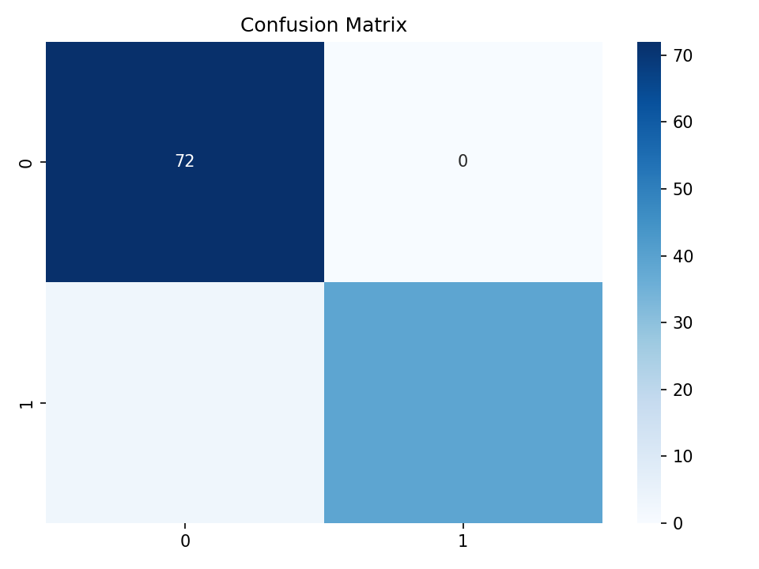
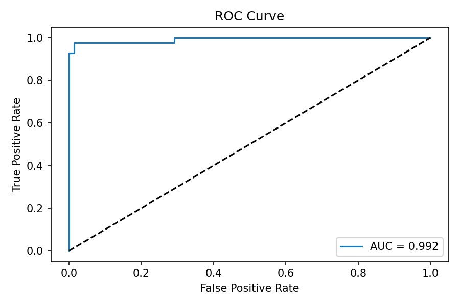
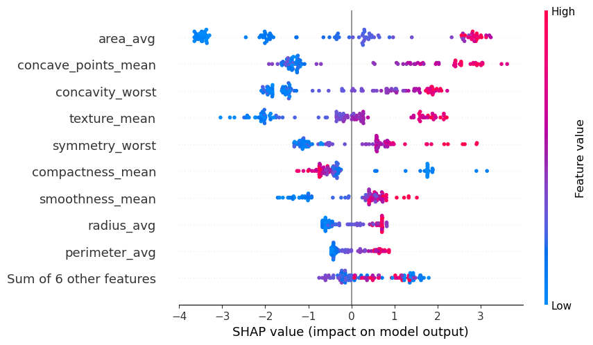

# 🧬 Breast Cancer Classification — End-to-End Machine Learning Pipeline

A full end-to-end machine learning project using the **Breast Cancer Wisconsin (Diagnostic) Dataset**, implementing:

- Automated preprocessing  
- Feature engineering  
- Feature selection (multi-method consensus)  
- Model benchmarking  
- Hyperparameter tuning  
- Explainability with SHAP  
- Error analysis  
- Production-ready inference pipeline (`predict.py`)  

This project follows an industry-grade structure suitable for real deployment and serves as a strong portfolio example for **Data Science / ML Engineering** roles.

---

## 🔑 Keywords  
Machine Learning, Classification, Breast Cancer, SHAP, Explainability, Medical AI, Gradient Boosting, Model Evaluation, Predictive Modeling, Python, scikit-learn, Healthcare Analytics, Pipeline, Feature Engineering

---

## 📌 1. Project Objective

Develop a robust and clinically interpretable machine learning model capable of classifying tumors as **benign** or **malignant** based on radiological measurements of cell nuclei.

Special focus areas:

- Clinical interpretability  
- Minimizing false negatives  
- SHAP-based explainability  
- Reliable production-ready inference  
- Clean, modular ML engineering practices  

---

## 📊 2. Dataset Overview

**Source:**  
https://www.kaggle.com/datasets/uciml/breast-cancer-wisconsin-data

- **Rows:** 569  
- **Features:** 30 numerical predictors  
- **Target:**  
  - `M` → Malignant  
  - `B` → Benign  

The dataset contains **no missing values**. Outliers were analyzed but **not removed**, as malignant cases naturally exhibit extreme tumor morphology.

---

## 🧱 3. Project Architecture

```
project_root/
│
├── data/
│ ├── raw/
│ └── processed/
│
├── notebooks/
│ ├── 01_EDA.ipynb
│ ├── 02_Preprocessing.ipynb
│ ├── 03_Modeling.ipynb
│ ├── 04_Feature_Selection.ipynb
│ ├── 05_Hyperparameter_Tuning.ipynb
│ ├── 06_Model_Evaluation.ipynb
│ └── 07_Testing_Inference.ipynb
│
├── src/
│ ├── config.py
│ ├── data/preprocessing.py
│ ├── models/final_model.pkl
│ └── inference/predict.py
│
├── imgs/ # Figures displayed in this README
└── requirements.txt
```

---

## ⚙️ 4. Technologies Used

- Python 3.10+  
- scikit-learn  
- pandas, numpy  
- seaborn, matplotlib, plotly  
- SHAP  
- joblib  
- JupyterLab  

---

## 🧼 5. Preprocessing Overview

The preprocessing pipeline includes:

- Label encoding (`M`/`B` → 1/0)  
- Standard scaling (fitted only on training data)  
- Feature engineering (`*_avg` smoothed features)  
- Variance filtering  
- Train/test splitting  
- Persisting datasets and scalers  

Outliers were preserved due to their clinical relevance in malignant tumors.

---

## 🧠 6. Feature Selection (Consensus Approach)

A multi-method feature selection strategy was used to reduce noise and increase classifier robustness by combining:

- ANOVA F-test  
- Mutual Information  
- SelectKBest  
- Random Forest importance  
- Gradient Boosting importance  
- SHAP global impact  
- Clinical interpretability  

A feature was selected only if it consistently appeared as relevant across **multiple methods** and matched tumor morphology patterns.

### 📊 Feature Selection Consensus Table

| Feature                 | ANOVA | RF Importance | GB Importance | SHAP | Final Choice |
|-------------------------|:-----:|:-------------:|:-------------:|:----:|:------------:|
| concave_points_mean     | ⭐⭐⭐  | ⭐⭐⭐⭐ | ⭐⭐⭐⭐ | ⭐⭐⭐⭐ | ✔ |
| concavity_worst         | ⭐⭐⭐  | ⭐⭐⭐⭐ | ⭐⭐⭐⭐ | ⭐⭐⭐⭐ | ✔ |
| symmetry_worst          | ⭐⭐   | ⭐⭐   | ⭐⭐⭐  | ⭐⭐   | ✔ |
| radius_avg              | ⭐⭐⭐  | ⭐⭐⭐  | ⭐⭐⭐  | ⭐⭐⭐  | ✔ |
| perimeter_avg           | ⭐⭐⭐  | ⭐⭐⭐  | ⭐⭐⭐  | ⭐⭐⭐  | ✔ |
| area_avg                | ⭐⭐⭐  | ⭐⭐⭐⭐ | ⭐⭐⭐⭐ | ⭐⭐⭐  | ✔ |
| radius_mean             | ⭐⭐⭐  | ⭐⭐⭐⭐ | ⭐⭐⭐⭐ | ⭐⭐⭐⭐ | ✔ |
| texture_mean            | ⭐⭐   | ⭐⭐   | ⭐⭐   | ⭐⭐   | ✔ |
| perimeter_mean          | ⭐⭐⭐  | ⭐⭐⭐⭐ | ⭐⭐⭐⭐ | ⭐⭐⭐⭐ | ✔ |
| area_mean               | ⭐⭐⭐  | ⭐⭐⭐⭐ | ⭐⭐⭐⭐ | ⭐⭐⭐⭐ | ✔ |
| smoothness_mean         | ⭐⭐   | ⭐⭐   | ⭐⭐   | ⭐⭐   | ✔ |
| compactness_mean        | ⭐⭐   | ⭐⭐   | ⭐⭐   | ⭐    | ✔ |
| concavity_mean          | ⭐⭐⭐  | ⭐⭐⭐⭐ | ⭐⭐⭐⭐ | ⭐⭐⭐⭐ | ✔ |
| symmetry_mean           | ⭐⭐   | ⭐⭐   | ⭐⭐   | ⭐⭐   | ✔ |
| fractal_dimension_mean  | ⭐    | ⭐⭐   | ⭐⭐   | ⭐    | ✔ |

---

## 📉 7. EDA — Correlation & Feature Insights

### 🔍 Interactive Correlation Heatmap (Plotly)

👉 [Click here to view the interactive heatmap](imgs/heatmap_75%.html)

This visualization helped identify multicollinearity and informed the consensus-based feature selection strategy.

---

## 🤖 8. Model Benchmarking

The following classifiers were trained and evaluated:

- Logistic Regression  
- SVM (RBF Kernel)  
- Random Forest  
- KNN  
- **Gradient Boosting (final model)**  

### 📊 Benchmark Results

| Model               | Accuracy | Precision | Recall | F1   | ROC_AUC |
|--------------------|---------:|----------:|-------:|------:|--------:|
| Logistic Regression | 0.947 | 0.909 | 0.952 | 0.930 | 0.992 |
| Random Forest       | 0.938 | 0.973 | 0.857 | 0.911 | 0.992 |
| **Gradient Boosting** | **0.973** | **1.000** | **0.928** | **0.962** | **0.992** |
| SVC (RBF)           | 0.956 | 0.974 | 0.904 | 0.938 | 0.985 |
| KNN                 | 0.964 | 0.975 | 0.928 | 0.951 | 0.972 |

> ✔ **Gradient Boosting** was selected for its superior recall stability and SHAP interpretability.

---

## 📈 9. Model Evaluation

### 🔢 Confusion Matrix  
The model achieved **zero false positives** and extremely low false negatives — critical for clinical settings.



---

### 📈 ROC Curve  
An exceptional **AUC = 0.992** demonstrates high class separability.



---

## 🧠 10. Explainability (SHAP)

SHAP was used to validate feature importance and ensure clinical interpretability.

### 🧬 SHAP Summary Plot  



Key insights:

- `concave_points_mean` and `concavity_worst` dominate malignancy prediction  
- Size-related features (`radius`, `area`, `perimeter`) significantly increase malignant probability  
- Symmetry-based features are useful for classifying borderline tumors  

---

## 🔍 11. Error Analysis

- **False negatives** mostly occur on borderline malignant cases  
- **False positives** appear in high-variance benign samples  
- Error distribution aligns with clinical expectations

---

## 🧪 12. Inference Pipeline (Production-Ready)

Located in: `src/inference/predict.py`.

### Single Sample Prediction

```python
from src.inference.predict import PredictionPipeline

pipeline = PredictionPipeline()
pipeline.predict_single({
    "radius_mean": 14.1,
    "texture_mean": 20.3,
    ...
})
```

### Batch Prediction

```python

df = pd.read_csv("new_samples.csv")
pipeline.predict_batch(df)

```

---

## 📦 13. Running the Full Pipeline

All development steps are available in the notebooks/ folder:

1. EDA
2. Preprocessing
3. Modeling
4. Feature Selection
5. Hyperparameter Tuning
6. Model Evaluation
7. Inference Testing

---

## 🛠️ 14. Future Work

FastAPI deployment
Dockerization
Nested cross-validation
SMOTE experiments
MLflow tracking
Drift monitoring

---

## 👤 Author

Mateus Vieira Vasconcelos
Data Science & Machine Learning Enthusiast